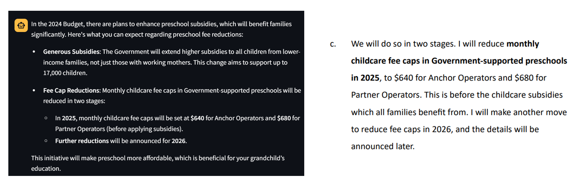

# About HTX Budget-2024-Chatbot

This is a chatbot application built using a Large Language Model (OpenAI GPT 4o) and Retrieval-Augmented Generation (RAG) to answer queries related to Singapore’s Finance Minister’s Budget 2024.

Tech stack for Backend and Frontend respectively: (i) LangChain, ChromaDB, OpenAI API, (ii) Streamlit

Assumption Made: For this simulation, a Streamlit form was used to collect basic user information, such as age and income level, to demonstrate the interaction. In a real-world application, it would be recommended to integrate with services like Singpass to automatically retrieve relevant data from government agencies or statutory boards, such as CPF (e.g., Medisave balances) and IRAS (for income information), ensuring a seamless and accurate user experience.

<div align="center">
  
</div>

## 1.0 Rationale of RAG Implementation
In the context of a Budget 2024 use-case, implementing a Retrieval Augmented Generation (RAG) approach is essential to overcome the limitations of pre-trained language models. While these models possess vast amounts of general knowledge from their pre-training, they lack the ability to access or generate responses based on real-time or highly specific data, such as the details from the Budget 2024 speech. RAG combines the strengths of retrieval-based systems and generative models by:
- Retrieval: Fetching up-to-date information to retrieve the most relevant information ensuring that the responses are accurate and aligned with the source data.
- Generation: After retrieval, RAG leverages the generative capabilities to generate contextually appropriate responses which are both factually accurate and contextually appropriate. This is important because public users may ask very nuanced type of questions about eligibility, policy changes etc.

## 2.0 Proposed Main Components & Architecture Diagram

These are the main components used:
- Chroma_db / sql-lite
- Semantic chunking using text-embedding-ada-002 embedding model || default breakpoint threshold type: percentile
- OpenAI API
- Streamlit
- Curated designed System Prompt

Illustration Diagram of the Preprocessing before the actual User Interaction

1. PDF Retrieval
-The first step involves fetching the relevant PDFs from the Ministry of Finance (MOF) website, which contain detailed information on the Singapore Budget 2024 and its annexes.

2. Chunking Techniques
-To make the documents searchable and improve response generation in the chatbot, the PDF content is divided into chunks using two methods (Recursive Character Chunking, Semantic Chunking).

4. Embedding with text-embedding-ada-002
Once the documents are chunked, each chunk is passed through the text-embedding-ada-002 model, which generates high-dimensional vector embeddings. These embeddings capture the semantic meaning of the text, which allows for efficient and accurate retrieval based on user queries.

5. ChromaDB Storage
-The generated embeddings are stored in ChromaDB, a specialized database designed for vector embeddings. This allows the chatbot to query and retrieve the most relevant chunks based on the user’s input, enabling dynamic response generation.

## 3.0 List of Prompts to Interact with LLM
This chatbot is designed to handle a variety of queries related to Singapore's Budget 2024. Below is a list of sample prompts that the chatbot is expected to address:

- **Am I eligible for the Majulah Package?**
<div align="center">
  
</div>

- **What are the key reasons for high inflation over the last two years?**
<div align="center">
  
</div>

- **Am I then eligible for Medisave Bonus?**
<div align="center">
  
</div>


## 4.0 Add the OpenAI API Key to the .env File
To allow the app to access OpenAI's services, you'll need to add your API key to an environment file in the same working directory:

- Create a .env file in the same directory where your Dockerfile and requirements.txt are located (if the file doesn't already exist).

- Open the .env file with any text editor.

- Add the following line to the .env file, replacing the example key with your actual OpenAI API key:
```bash
  OPENAI_API_KEY=my-api-key-here
```

## 5.0 Build & Run the Docker Image

To build the Docker image for this Streamlit app, navigate to the directory containing the `Dockerfile` and run the following command:

```bash
docker build -t my-streamlit-app . --no-cache --progress=plain
```

To run & open the Docker image for this Streamlit app, and run the following commands:

```bash
docker run -p 8501:8501 my-streamlit-app
```

Open the streamlit url using your local browser via:

```bash
http://localhost:8501
```

## Bonus Features (Planned/Completed)
- ✅ **Chunking Strategies**: Comparison of various Chunking Strategies + Rationale for selecting final Approach
- ✅ **Streaming effect on chat**: Chat Streaming Effect
