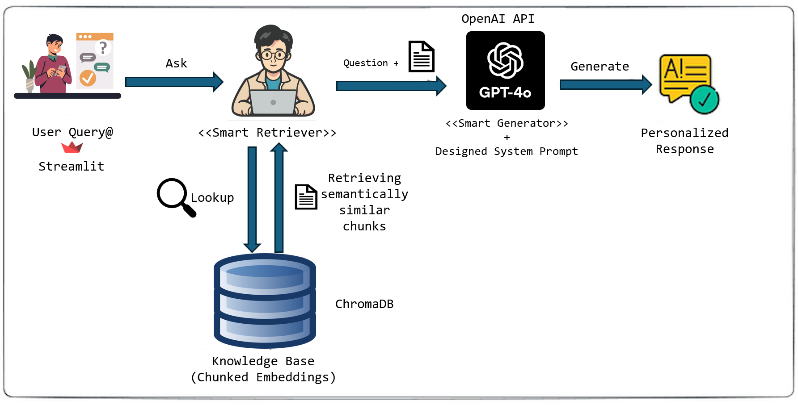
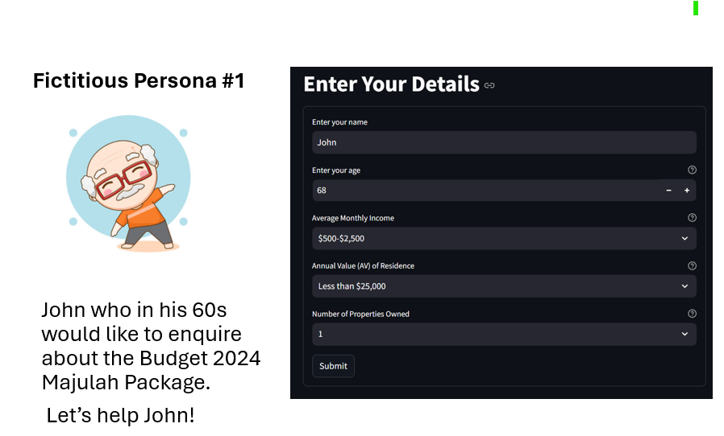

# 🚀 About HTX Budget-2024-Chatbot 🤖
This is a chatbot application built using a OpenAI LLM/LMM and Retrieval-Augmented Generation (RAG) to answer queries related to Singapore’s Finance Minister’s Budget 2024.

Tech stack for Backend and Frontend and Deployment respectively: (i) `LangChain`, `ChromaDB`, `OpenAI API`,  (ii) `Streamlit`, (iii) `Docker`

Assumption Made: For this simulation, a Streamlit form was used to collect basic user information, such as age and income level, to demonstrate the interaction. In a real-world application, it would be recommended to integrate with services like Singpass to automatically retrieve relevant data from government agencies or statutory boards, such as CPF (e.g., Medisave balances) and IRAS (for income information), ensuring a seamless and accurate user experience.

<div align="center">
  
</div>

## 1.0 Rationale of RAG Implementation
In the context of a Budget 2024 use-case, implementing a Retrieval Augmented Generation (RAG) approach is essential to overcome the limitations of pre-trained language models. While these models possess vast amounts of general knowledge from their pre-training, they lack the ability to access or generate responses based on real-time or highly specific data, such as the details from the Budget 2024 speech. RAG combines the strengths of retrieval-based systems and generative models by:
- Retrieval: Fetching up-to-date information to retrieve the most relevant information ensuring that the responses are accurate and aligned with the source data.
- Generation: After retrieval, RAG leverages the generative capabilities to generate contextually appropriate responses which are both factually accurate and contextually appropriate. This is important because public users may ask very nuanced type of questions about eligibility, policy changes etc.

## 2.0 Proposed Main Components & Architecture Diagram

These are the main components used:
- Chroma_db / sql-lite
- Semantic chunking using `text-embedding-ada-002` embedding model || default breakpoint threshold type: percentile
- OpenAI API
- Streamlit
- Curated designed System Prompt

Illustration Diagram of the Preprocessing before the actual User Interaction

1. PDF Retrieval
-The first step involves fetching the relevant PDFs from the Ministry of Finance (MOF) website, which contain detailed information on the Singapore Budget 2024 and its annexes.

2. Chunking Techniques
-To make the documents searchable and improve response generation in the chatbot, the PDF content is divided into chunks using two methods (Recursive Character Chunking, Semantic Chunking).
- This repo consists of the chromadb chunks. However, to scale this even further with recursive character chunking, you can use the following command after making the internal variable changes:
```bash
python create_database.py
```
- This repo consists of the chromadb chunks. However, to scale this even further with semantic chunking, you can use the following command after making the internal variable changes:
```bash
python create_database2.py
```

4. Embedding with text-embedding-ada-002
Once the documents are chunked, each chunk is passed through the `text-embedding-ada-002` model, which generates high-dimensional vector embeddings. These embeddings capture the semantic meaning of the text, which allows for efficient and accurate retrieval based on user queries.

5. ChromaDB Storage
-The generated embeddings are stored in ChromaDB, a specialized database designed for vector embeddings. This allows the chatbot to query and retrieve the most relevant chunks based on the user’s input, enabling dynamic response generation.

## 3.0 List of Prompts to Interact with LLM
This chatbot is designed to handle a variety of queries related to Singapore's Budget 2024. Below is a list of sample prompts that the chatbot is expected to address

<div align="center">
  
</div>

Let's consider John who is in his late 60s looking into how he can benefit from the Majulah Package. Deliberation of not providing other Basic Information (e.g. Medisave) but only Earn and Save Bonus (ESB) for this scenario. Hence, we expect that the chatbot should not answer anything about the Medisave or other components within the Majulah Package but only the ESB. https://www.mof.gov.sg/docs/librariesprovider3/budget2024/download/pdf/annexf2.pdf

- **Am I eligible for the Majulah Package? and how much is it**
<div align="center">
  
</div>
Remarks: As we can see from here, the chatbot indeed provide the information such as the Age/Income level/Annual Residence Value which provided the answers about ESB Component within Majulah Package. 

- **What are the key reasons for high inflation over the last two years?**
<div align="center">
  
</div>


- **I'm just curious what will be done in reducing my grandchild's fee in preschool?**
<div align="center">
  
</div>


## 4.0 Add the OpenAI API Key to the .env File
To allow the app to access OpenAI's services, you'll need to add your API key to an environment file in the same working directory:

- Create a `.env file` in the same directory where your Dockerfile and requirements.txt are located (if the file doesn't already exist).

- Open the `.env file` file with any text editor.

- Add the following line to the `.env file` file, replacing the example key with your actual `OpenAI API Key`:
```bash
  OPENAI_API_KEY=my-api-key-here
```

## 5.0 Build & Run the Docker Image

To build the Docker image for `my-streamlit-app`, navigate to the directory containing the `Dockerfile` and run the following command:

```bash
docker build -t my-streamlit-app . --no-cache --progress=plain
```
<div align="center">
  
</div>

To run & open the Docker image for `my-streamlit-app` by exposing the port you want, and run the following command:

```bash
docker run -p 8501:8501 my-streamlit-app
```
<div align="center">
  
</div>

Double check using Docker Desktop on the image / streamlit app created:

<div align="center">
  
</div>

Open the streamlit url using your local browser via:

```bash
http://localhost:8501
```

## 6.0 Bonus Features Section Overview Explaination

<div align="center">
  
</div>

Feature #1: Chunking Strategies
- The choice of chunking strategy will have significant impact on retrieval performance.
Traditional text splitting methods often break documents at arbitrary points, which will potentially affect the disruption of information flow & context. E.g. Recursive character text split
While using the chunk overlap will help to share some standard text with adjacent chunks, the cut-off point between two meaningful chunks needed more structural/empirical method to evaluate. I considered playing with this chunkviz to explore the tradeoffs https://chunkviz.up.railway.app/. So, we consider using semantic chunking to split text at a more natural breakpoints so that it can preserve the semantic coherence within each chunk.
  
<div align="center">
  
</div>

Feature #2: Annex Hyperlink Citation
- ✅ **Meta Tagging**: Stores and retrieves metadata (such as annex references) in ChromaDB for PDF content.  
- ✅ **LLM for Formatting**: Utilizes few-shot learning with an LLM to format the citations and hyperlinks correctly.  
- ✅ **Post-Processing**: Uses regex-based matching and conditional replacing to embed the hyperlinks into the generated text. Implementation can be found more at `utils.py`.

Feature #3: Adaptive System Prompt from User Profile
<div align="center">
  
</div>

-  This system features an adaptive prompt mechanism that dynamically adjusts based on the user's session state, retrieving and storing essential user information such as age, income level, and other demographic data. By maintaining session state, the system personalizes responses and tailors the content to the user's profile, ensuring relevant information, such as eligibility. This approach will help in user experience by maintaining context across interactions.

Feature #4: Streaming effect on chat
- Refer to the demo for clearer demonstration on ASSISTANT/USER streaming of the responses. Refer to the youtube video here. 
<div align="center">
  <a href="https://youtu.be/F-md5zcaPgw?si=ct6DqmS9NYlfb6PI">
    
  </a>
</div>

## 7.0 Deployment at AWS EC2
<div align="center">
  
</div>

Follow these steps to deploy the Streamlit app on an AWS EC2 instance. The deployment assumes you are using an Ubuntu EC2 instance.
For ease of access, you may visit the url here http://47.129.145.115:8501/.

### 7.1 Prerequisites
- AWS EC2 instance running Ubuntu (ensure security group allows inbound traffic to port e.g. 8501).
- SSH access to the EC2 instance.
- AWS EC2 Instance to be created

### 7.2 Connect to Your EC2 Instance
First, connect to your EC2 instance using SSH:

```bash
ssh -i /path/to/your-key.pem ubuntu@<your-ec2-public-ip>
```

### 7.3 Udate and Install Required Packages/Systems
```bash
sudo apt update
sudo apt-get update
sudo apt upgrade -y

sudo apt install git curl unzip tar make sudo vim wget -y
sudo apt install python3-pip
```
### 7.4  Git clone this repo
```bash
git clone https://github.com/sciencenerd880/Budget-2024-Chatbot.git
```
### 7.5  Set up Virtual Environment & Create, Activate the venv in the project folder
```bash
sudo apt install python3-venv
python3 -m venv venv
source venv/bin/activate
```

### 7.6 Install all the Project Dependencies
```bash
pip3 install -r requirements.txt
```

### Running the application is as easy as
```bash
python3 -m streamlit run streamlit_app.py
```
View the webpage via the InstanceDomain:PortNumber
e.g. http://47.129.145.115:8501/
where 8501 is the port that was set up
<div align="center">
  
</div>

## Bonus Features (Completed)
- ✅ **Deployment at AWS EC2**: Deployed the Streamlit App at AWS Cloud Service - EC2
- ✅ **Chunking Strategies**: Comparison of various Chunking Strategies + Rationale for selecting final Approach
- ✅ **Annex Hyperlink Citation**: Cite the url links via few shot learnning strategy + post-processing
- ✅ **Adaptive System Prompt from User Profile**: Tailoring response after comprehending the User Profile 
- ✅ **Streaming effect on chat**: Chat Streaming Effect on Greetings by Assistant, Responses from Assistant, as well as User Query.
